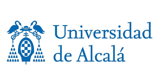
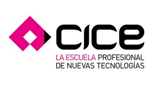
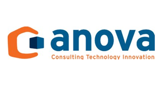
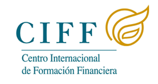

#Campus
##formación e investigación

En Chaotic Kingdoms mantenemos una estrecha relación con la Universidad de Alcalá, ya que parte de nuestro equipo trabaja en investigaciones científicas dirigidas por dicha institución. Nuestro principal campo de investigación es el del uso de redes sociales y la gamificación en el ámbito de la educación para adultos.

Debido a los reveladores resultados que estamos consiguiendo en nuestra actividad investigadora, desde Chaotic Kingdoms Campus deseamos poner a su servicio nuestra experiencia para:

* Crear cursos online atractivos y motivadores
* Mejorar los procesos de formación en todo tipo de organizaciones
* Implantar sistemas de colaboración efectivos en medianas y grandes empresas

___

#### Colaboramos en diversos cursos y másteres sobre tecnologías de desarrollo de software
Mantenemos una estrecha relación con distintas entidades dedicadas a la **formación**, entre las que destacan:

 {.responsive-img .quarter}
 {.responsive-img .quarter}
 {.responsive-img .quarter}
 {.responsive-img .quarter}

#### Algunos de los últimos cursos que hemos impartido